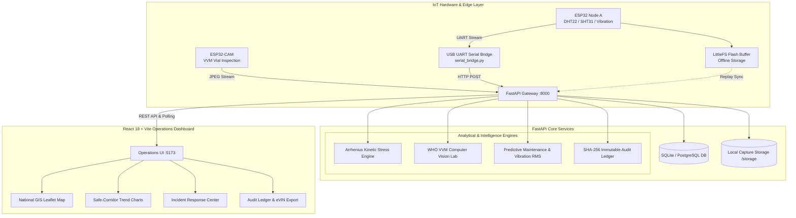

# 🧊 Smart AI & IoT Vaccine Cold-Chain Management Platform

[](https://fastapi.tiangolo.com)
[](https://reactjs.org/)
[](https://www.typescriptlang.org/)
[](https://vitejs.dev/)
[](https://tailwindcss.com/)
[](https://www.python.org/)
[](LICENSE)

> **Monitor &rarr; Predict &rarr; Verify &rarr; Act &rarr; Prove Compliance**

An end-to-end, mission-critical cold-chain management and compliance monitoring system designed for public health supply chains—including Primary Health Centres (PHCs), Regional Vaccine Depots, and Mobile Transport Corridors. Engineered for rural environments with intermittent electricity and network connectivity, the platform integrates **physical ESP32 IoT telemetry**, **offline-first cryptographic audit trails**, **Arrhenius kinetic thermal degradation modeling**, **Computer Vision WHO Vaccine Vial Monitor (VVM) validation**, and **predictive cooling equipment maintenance**.

---

## 📑 Table of Contents

- [Key Features](#-key-features)
- [System Architecture](#-system-architecture)
- [Project Structure](#-project-structure)
- [Tech Stack](#-tech-stack)
- [Getting Started](#-getting-started)
  - [Prerequisites](#prerequisites)
  - [1. Backend Setup](#1-backend-setup)
  - [2. Frontend Setup](#2-frontend-setup)
  - [3. Hardware Serial Bridge (Optional / Physical Node)](#3-hardware-serial-bridge-optional--physical-node)
- [API Documentation & Main Endpoints](#-api-documentation--main-endpoints)
- [IoT & Telemetry Formats](#-iot--telemetry-formats)
- [Mathematical & AI Models](#-mathematical--ai-models)
  - [Arrhenius Kinetic Thermal Stress](#arrhenius-kinetic-thermal-stress)
  - [Computer Vision WHO VVM Classifier](#computer-vision-who-vvm-classifier)
  - [SHA-256 Tamper-Evident Hash Chain](#sha-256-tamper-evident-hash-chain)
- [Interactive Dashboard Tabs](#-interactive-dashboard-tabs)
- [Contributing & License](#-contributing--license)

---

## 🌟 Key Features

### 1. 📡 Physical & Simulated IoT Ingestion (Offline-First)
- **ESP32 Microcontroller Support**: Collects real-time temperature, humidity, and vibration RMS metrics from cold boxes and Ice-Lined Refrigerators (ILR).
- **LittleFS Flash Buffer**: Nodes store readings locally during power outages and network loss, bulk-syncing on reconnection without data gaps.
- **Dual Telemetry Parsing**: Ingests standard JSON payloads and compact pipe-delimited UART telemetry logs (`record#|timestamp|temp|humidity|condition|action|confidence|prevHash|currHash`).
- **Live USB Serial Bridge (`serial_bridge.py`)**: Seamlessly bridges connected physical ESP32 boards on COM/TTY ports straight to the FastAPI backend.

### 2. 🧪 Kinetic Degradation & Arrhenius Thermal Stress
- Goes beyond binary thresholds (2°C–8°C) by calculating **cumulative kinetic thermal degradation** using Arrhenius reaction rate kinetics.
- Differentiates **freeze excursions (< 2°C)**—which cause rapid, irreversible damage to freeze-sensitive vaccines (e.g., Hepatitis B, Pentavalent, Td)—from **heat excursions (> 8°C)**.
- Computes real-time **batch viability percentages** and dynamic shelf-life reduction for each individual vaccine lot.

### 3. 👁️ Computer Vision: WHO Vaccine Vial Monitor (VVM) Classifier
- Automated image processing of standard WHO Vaccine Vial Monitors using Pillow computer vision routines.
- Evaluates colorimetric distance ($\Delta E$) and luminance contrast between the inner indicator square and outer reference circle.
- Classifies vials into **WHO Stages 1 to 4**:
  - **Stage 1**: Fresh / Fully Usable
  - **Stage 2**: Heat Exposed / Use First
  - **Stage 3**: Endpoint Reached / Do Not Use (Discard)
  - **Stage 4**: Beyond Discard / Severe Heat Spoilage
- **Cross-Reference Engine**: Flags discrepancies where sensor data and visual VVM disagree (identifying off-sensor exposure or sensor calibration drift).

### 4. ⚙️ Predictive Equipment Maintenance & Vibration RMS
- Tracks compressor vibration RMS (mm/s), harmonic drift, and door seal thermal integrity.
- Detects mechanical fatigue prior to temperature spikes.
- Calculates **Estimated Time to Failure (TTF in days)** with recommended preventative maintenance actions.

### 5. 🔗 Cryptographic SHA-256 Compliance Ledger (eVIN Ready)
- Implements an immutable, chained ledger matching ESP32 hardware `mbedtls` hashing.
- Every reading links cryptographically to the preceding record's hash (`genesis` &rarr; `block N`).
- Built-in verification engine audits the complete ledger in milliseconds to detect retroactive modification or tampering.
- Single-click CSV export formatted for eVIN and WHO regulatory compliance audits.

### 6. 🗺️ National Cold-Chain GIS Dashboard
- Interactive Leaflet-powered map displaying national PHCs, regional stores, and transport corridors.
- Real-time power grid vs. battery backup status indicators.
- Safe-corridor telemetry charts (Recharts) with 2°C–8°C safe zones.
- Multi-tier alert incident triage and acknowledgment workflow.

---

## 🏛️ System Architecture



---

## 📂 Project Structure

```
Cold-chain/
├── .gitignore                      # Git exclusion rules
├── README.md                       # Main project documentation
├── backend/
│   ├── README.md                   # Backend quick-start guide
│   ├── coldchain.db                # SQLite database (auto-generated)
│   ├── requirements.txt            # Python dependencies (FastAPI, SQLAlchemy, Pillow, etc.)
│   ├── serial_bridge.py            # Serial COM port listener for physical ESP32 boards
│   ├── app/
│   │   ├── __init__.py
│   │   ├── database.py             # Database engine, session maker, storage directories
│   │   ├── main.py                 # FastAPI application, route handlers, middleware
│   │   ├── models.py               # SQLAlchemy ORM models (Locations, Devices, Batches, VVM, etc.)
│   │   ├── schemas.py              # Pydantic request/response schemas
│   │   └── services.py             # Arrhenius modeling, VVM CV analysis, hash verification, seeds
│   └── storage/
│       └── captures/               # Stored camera captures and synthetic VVM images
│
└── frontend/
    ├── index.html                  # Main HTML entry point
    ├── package.json                # Node.js dependencies & scripts
    ├── postcss.config.js           # PostCSS configuration
    ├── setup-frontend.bash         # Bootstrap/automation script
    ├── tailwind.config.js          # Tailwind CSS design tokens
    ├── tsconfig.json               # TypeScript compiler options
    ├── vite.config.ts              # Vite configuration (path aliases, plugins)
    └── src/
        ├── App.tsx                 # Root React component with TanStack Query provider
        ├── main.tsx                # React DOM render entry
        ├── index.css               # Global stylesheet & design tokens
        ├── components/
        │   ├── dashboard/          # Dashboard widgets (Map, Charts, VVM Lab, Ledger, etc.)
        │   ├── layout/             # Header, Sidebar, Navigation
        │   └── ui/                 # UI primitives (Cards, Badges, Buttons, Toasts)
        ├── hooks/                  # React Query data fetching hooks & mutations
        ├── lib/                    # Utility functions (cn, formatters)
        ├── pages/
        │   └── Dashboard.tsx       # Main tabbed command center
        └── types/                  # TypeScript interface definitions
```

---

## 🛠️ Tech Stack

### Frontend
- **Framework**: React 18 with TypeScript
- **Bundler**: Vite 5
- **Styling**: Tailwind CSS, Class Variance Authority (`cva`), `tailwind-merge`
- **Data Fetching**: TanStack React Query v5
- **Mapping**: Leaflet & React-Leaflet
- **Visualizations**: Recharts
- **Icons**: Lucide React
- **Primitives**: Radix UI (Dialog, Tooltip, Dropdown, Tabs)

### Backend
- **Framework**: FastAPI (Python 3.10+)
- **Server**: Uvicorn (ASGI)
- **Database ORM**: SQLAlchemy 2.0
- **Validation**: Pydantic v2
- **Image Processing**: Pillow (PIL)
- **Hardware Comms**: PySerial, HTTPX

---

## 🚀 Getting Started

### Prerequisites
- **Python**: `3.10` or higher
- **Node.js**: `18.x` or higher (`npm` or `pnpm`)
- **Git**: Installed and configured

---

### 1. Backend Setup

1. **Navigate to the backend directory**:
   ```bash
   cd backend
   ```

2. **Create and activate a virtual environment**:
   - **Windows (PowerShell)**:
     ```powershell
     python -m venv venv
     .\venv\Scripts\Activate.ps1
     ```
   - **Linux / macOS**:
     ```bash
     python3 -m venv venv
     source venv/bin/activate
     ```

3. **Install dependencies**:
   ```bash
   pip install -r requirements.txt
   ```

4. **Start the FastAPI server**:
   ```bash
   uvicorn app.main:app --reload --port 8000
   ```

5. **Verify Backend Health**:
   - Healthcheck: [http://127.0.0.1:8000/health](http://127.0.0.1:8000/health)
   - Interactive Swagger API Docs: [http://127.0.0.1:8000/docs](http://127.0.0.1:8000/docs)
   - Alternative ReDoc: [http://127.0.0.1:8000/redoc](http://127.0.0.1:8000/redoc)

---

### 2. Frontend Setup

1. **Open a new terminal and navigate to `frontend`**:
   ```bash
   cd frontend
   ```

2. **Install Node packages**:
   ```bash
   npm install
   ```

3. **Start the development server**:
   ```bash
   npm run dev
   ```

4. **Open the Dashboard in your browser**:
   Navigate to [http://localhost:5173](http://localhost:5173).

---

### 3. Hardware Serial Bridge (Optional / Physical Node)

If you have a physical ESP32 microcontroller broadcasting sensor logs via USB:

1. Connect the ESP32 to your computer via USB.
2. Verify the assigned COM port (e.g., `COM7` on Windows or `/dev/ttyUSB0` on Linux).
3. Open `backend/serial_bridge.py` and set `COM_PORT = 'COM7'` (or your port).
4. Run the bridge:
   ```bash
   python backend/serial_bridge.py
   ```
5. Live sensor readings will stream directly into the local FastAPI database and refresh the dashboard automatically.

---

## 📡 API Documentation & Main Endpoints

| Category | Method | Endpoint | Description |
|---|---|---|---|
| **System** | `GET` | `/health` | Service health status and storage check |
| **Dashboard** | `GET` | `/api/v1/dashboard/summary` | Top 8 mission metrics (safe lots, critical alerts, power cuts, etc.) |
| **Locations** | `GET` | `/api/v1/locations` | List all PHCs, regional cold stores, and transport carriers |
| **IoT Telemetry** | `GET` | `/api/v1/devices` | List registered sensor units and battery/vibration scores |
| | `GET` | `/api/v1/devices/{id}/telemetry` | Historical time-series temperature & humidity data |
| | `POST` | `/api/v1/sensor/readings` | Ingest sensor reading (JSON or ESP32 pipe format) |
| | `POST` | `/api/v1/sensor/sync-offline` | Bulk ingest LittleFS buffered packets after reconnection |
| **Vaccine Batches** | `GET` | `/api/v1/batches` | List all vaccine batches with Arrhenius stress scores |
| | `GET` | `/api/v1/batches/{id}` | Detailed batch view, thermal history, and VVM logs |
| | `POST` | `/api/v1/batches` | Register a new incoming vaccine batch |
| **VVM Vision Lab** | `GET` | `/api/v1/vvm/scans` | List historical WHO VVM computer vision scans |
| | `POST` | `/api/v1/vvm/analyze` | Analyze uploaded or synthetic vial image |
| **Cameras** | `GET` | `/api/v1/cameras` | List connected ESP32-CAM devices |
| | `POST` | `/api/v1/cameras/{id}/capture` | Trigger camera capture and trigger VVM analysis |
| **Predictive** | `GET` | `/api/v1/predictive-maintenance` | Predictive maintenance alerts & compressor drift TTF |
| **Compliance** | `GET` | `/api/v1/compliance/ledger` | Query the SHA-256 hash-chained immutable audit records |
| | `GET` | `/api/v1/compliance/verify-chain` | Cryptographically verify the integrity of the full chain |
| | `POST` | `/api/v1/compliance/tamper-test` | Inject synthetic tampering to demonstrate audit detection |
| | `GET` | `/api/v1/compliance/export-evin` | Export compliant audit trail as CSV for eVIN records |
| **Alerts** | `GET` | `/api/v1/alerts` | List all open and historical incidents |
| | `POST` | `/api/v1/alerts/{id}/acknowledge` | Acknowledge and resolve an active alert |
| **Simulation** | `POST` | `/api/v1/simulation/tick` | Emit a synthetic sensor event for demo and testing |

---

## 🔌 IoT & Telemetry Formats

The backend supports two ingestion formats on `POST /api/v1/sensor/readings`:

### A. Structured JSON Format
```json
{
  "device_code": "ESP32-NODE-01",
  "device_name": "ESP32 Cold Chain Node A",
  "record_number": 1042,
  "temperature": 4.8,
  "humidity": 62.0,
  "vibration_rms": 1.25,
  "condition": "NORMAL",
  "action": "CONTINUE",
  "confidence": 98.0,
  "previous_hash": "A3F8...29B1",
  "current_hash": "C9D0...78E4"
}
```

### B. Compact ESP32 Pipe Format (UART / Serial)
```text
1042|2026-08-21 14:02:10|4.8|62.0|NORMAL|CONTINUE|98|A3F8...29B1|C9D0...78E4
```

---

## 🧮 Mathematical & AI Models

### Arrhenius Kinetic Thermal Stress
Vaccine degradation is non-linear. The platform models cumulative thermal stress using an Arrhenius-based formulation:

$$k = A \cdot \exp\left(-\frac{E_a}{R \cdot T}\right)$$

- **Safe Range (2.0°C – 8.0°C)**: Incremental stress is zero (standard shelf decay $\approx 0.05/\text{hr}$).
- **Heat Excursions (> 8.0°C)**:
  $$\Delta \text{Stress} = (1.35)^{\min(\Delta T, 15)} \times 1.8 \times \Delta t$$
- **Freeze Excursions (< 2.0°C)**:
  $$\Delta \text{Stress} = 14.0 \times (2.0 - T) \times \Delta t$$
  *(Reflecting rapid structural denaturation of aluminum hydroxide adjuvants).*

### Computer Vision WHO VVM Classifier
1. Samples the inner indicator square ($\text{ROI}_{\text{inner}}$) and outer reference circle ($\text{ROI}_{\text{outer}}$).
2. Calculates standard luminance:
   $$Y = 0.299R + 0.587G + 0.114B$$
3. Evaluates luminance contrast $\Delta Y = Y_{\text{inner}} - Y_{\text{outer}}$ and Euclidean color distance:
   $$\Delta E = \sqrt{(\Delta R)^2 + (\Delta G)^2 + (\Delta B)^2}$$
4. Classifies:
   - $\Delta Y > 40$: **Stage 1 (Fresh / Usable)**
   - $10 < \Delta Y \le 40$: **Stage 2 (Heat Exposed / Use First)**
   - $-15 \le \Delta Y \le 10$: **Stage 3 (Endpoint / Do Not Use)**
   - $\Delta Y < -15$: **Stage 4 (Beyond Discard)**

### SHA-256 Tamper-Evident Hash Chain
Each audit block $B_i$ is computed as:

$$\text{Hash}_i = \text{SHA256}\left(i \parallel \text{Timestamp} \parallel \text{Temp} \parallel \text{Humidity} \parallel \text{Condition} \parallel \text{Action} \parallel \text{Confidence} \parallel \text{Hash}_{i-1}\right)$$

Any modification to historical record $k$ breaks all hashes from $k+1$ to $N$, instantly flagged by `/api/v1/compliance/verify-chain`.

---

## 🖥️ Interactive Dashboard Tabs

1. **📊 Overview**: Key metrics, national Leaflet facility map, live telemetry safe-corridor chart, and priority incident feed.
2. **📦 Batches**: Vaccine lot catalog, Arrhenius stress bars, remaining doses, and shelf viability percentages.
3. **🗺️ Locations**: Network grid overview of PHCs, Regional Stores, power grid statuses, and battery backup reserves.
4. **👁️ VVM Vision Lab**: Interactive camera snapshot analysis, WHO Stage 1–4 classification, and colorimetric difference verification.
5. **⚙️ Predictive Maintenance**: Cooling equipment health scores, vibration harmonic analysis, and estimated failure times.
6. **🔗 Compliance Ledger**: Cryptographic audit records, blockchain integrity validator, and one-click eVIN export.
7. **🚨 Alerts**: Active incident management with real-time acknowledgment.
8. **📡 IoT Gateway**: ESP32 device registry, firmware versions, battery status, and simulation test bench.

---

## 📄 Contributing & License

Contributions, issues, and feature requests are welcome!

1. Fork the project.
2. Create your feature branch (`git checkout -b feature/AmazingFeature`).
3. Commit your changes (`git commit -m 'Add some AmazingFeature'`).
4. Push to the branch (`git push origin feature/AmazingFeature`).
5. Open a Pull Request.

This project is licensed under the **MIT License**.
